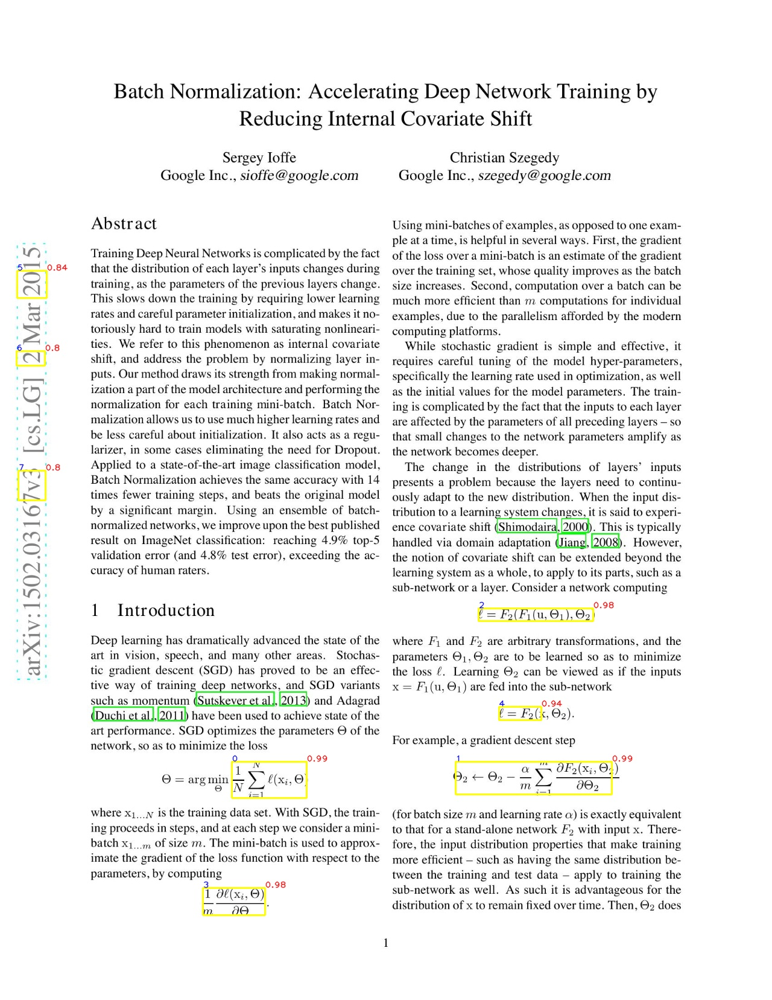

# Paper2Tex

The following project is a tool to extract equations from the research paper and convert it into latex code. 

This project is heavily utilizes the following projects:

- [ScanSSD: Scanning Single Shot Detector for Math in Document Images](https://github.com/MaliParag/ScanSSD)
- [ScanSSD (fork)](https://github.com/jjdredd/ScanSSD/)
- [pix2tex - LaTeX OCR](https://github.com/lukas-blecher/LaTeX-OCR/)

Credit goes to the authors of the above projects, [@MaliParag](https://github.com/MaliParag), [@lukas-blecher](https://github.com/lukas-blecher/LaTeX-OCR/), [@jjdredd](https://github.com/jjdredd).

## How to use?

`paper2tex.ipynb` is the main notebook. It contains the code to extract equations from the paper. The notebook is self explanatory.

## Example

Extracted equations are in boxes with yellow border. In top left corner of each box, there is a number which is the id of the equation, and on the top right corner.  
The extracted equations are:

- $$\text{id:}0 \Rightarrow {\frac{1}{N}}\sum_{i=1}^{N}\ell(\mathbf{x}_{i},\Theta)$$
- $$\text{id:}1 \Rightarrow \Theta\_{2}\leftarrow\Theta\_{2}-\frac{\alpha}{m}\sum\_{i=1}^{m}\frac{\partial F\_{2}({\bf x}_{i},\Theta\_{2})}{\partial\Theta\_{2}}$$      
- $$\text{id:}2 \Rightarrow \ell=F_{2}(F_{1}(\mathbf{u},\Theta_{1}),\Theta_{2})$$
- $$\text{id:}3 \Rightarrow {\frac{1}{m}}{\frac{\partial\ell(\mathbf{x}_{i},\Phi)}{\partial\Theta}}$$
- $$\text{id:}4 \Rightarrow \ell=F_{2}(\cdot)$$

## Things to do

- [x] Add a notebook to extract equations from the paper.
- [x] Implement a GPU version of the code.
- [x] Upload it to the `colab`
- [ ] Find a way to use inference `LaTeX-OCR` in batch mode.