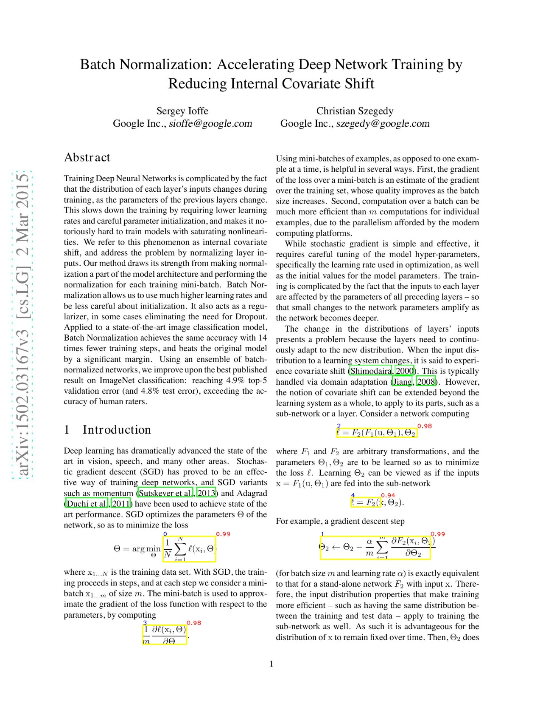

# Paper2Tex

The following project is a tool to extract equation from the research paper and convert it into latex code. 

This project is heavily utilizes the following projects:

- [ScanSSD: Scanning Single Shot Detector for Math in Document Images](https://github.com/MaliParag/ScanSSD)
- [pix2tex - LaTeX OCR](https://github.com/lukas-blecher/LaTeX-OCR/)

## Example

Extracted equations are in boxes with yellow border. In top left corner of each box, there is a number which is the id of the equation, and on the top right corner.  
The extracted equations are:

- $\text{id:}0 \rightarrow {\frac{1}{N}}\sum_{i=1}^{N}\ell(\mathbf{x}_{i},\Theta)$    
- $\text{id:}1 \rightarrow \Theta_{2}\leftarrow\Theta_{2}-\frac{\alpha}{m}\sum_{i=1}^{m}\frac{\partial F_{2}({\bf x}_{i},\Theta_{2})}{\partial\Theta_{2}}$    
- $\text{id:}2 \rightarrow \ell=F_{2}(F_{1}(\mathbf{u},\Theta_{1}),\Theta_{2})$    
- $\text{id:}3 \rightarrow {\frac{1}{m}}{\frac{\partial\ell(\mathbf{x}_{i},\Phi)}{\partial\Theta}}$    
- $\text{id:}4 \rightarrow \ell=F_{2}(\cdot)$    